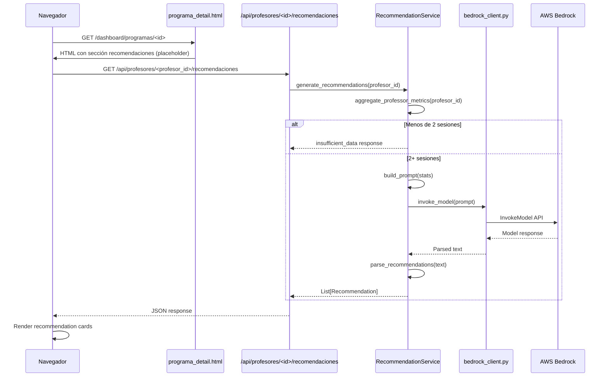

# Design Document: AI Teacher Recommendations

## Overview

Esta funcionalidad agrega un módulo de recomendaciones inteligentes a GymSight que utiliza AWS Bedrock para generar consejos personalizados para profesores de gimnasio. El sistema recopila el historial de métricas de rendimiento de un profesor (asistencia, permanencia, claridad, ratio habla/demostración, satisfacción), calcula estadísticas resumidas y tendencias, y envía estos datos a un modelo de lenguaje vía Bedrock para producir entre 3 y 5 recomendaciones accionables en español.

El flujo principal es:
1. El usuario visita la página de detalle de un programa
2. El frontend realiza una llamada asíncrona al endpoint de recomendaciones
3. El backend agrega las métricas históricas del profesor asociado
4. Se construye un prompt estructurado y se invoca Bedrock
5. Se parsea la respuesta y se devuelve al frontend como JSON
6. El frontend renderiza las recomendaciones como tarjetas debajo de los gráficos

### Decisiones de Diseño

- **Sin persistencia de recomendaciones**: Las recomendaciones se generan bajo demanda y no se almacenan en base de datos. Esto garantiza que siempre reflejen el estado más reciente de las métricas sin necesidad de invalidación de caché.
- **Endpoint API separado**: Se usa un endpoint REST independiente (no server-side rendering) para permitir carga asíncrona y no bloquear la renderización de la página.
- **Mismo patrón boto3**: Se reutiliza `get_boto_client` para mantener consistencia con los demás servicios AWS del proyecto.

## Architecture



### Estructura de Módulos

```
app/
├── services/
│   ├── aws/
│   │   ├── bedrock_client.py          # Nuevo: cliente AWS Bedrock
│   │   └── boto_session.py            # Existente: get_boto_client
│   └── recommendation_service.py      # Nuevo: lógica de agregación + prompt
├── routes/
│   └── api.py                         # Nuevo: blueprint para endpoints API
├── templates/
│   └── programa_detail.html           # Modificar: agregar sección recomendaciones
└── static/
    └── js/
        └── recommendations.js         # Nuevo: fetch + render de recomendaciones
```

## Components and Interfaces

### 1. `app/services/aws/bedrock_client.py`

Cliente que encapsula la comunicación con AWS Bedrock.

```python
def invoke_model(prompt: str, max_tokens: int = 1024) -> str:
    """
    Invoca AWS Bedrock InvokeModel API.

    Args:
        prompt: Texto del prompt a enviar al modelo.
        max_tokens: Número máximo de tokens en la respuesta.

    Returns:
        Texto generado por el modelo.

    Raises:
        ConfigurationError: Si BEDROCK_MODEL_ID no está configurado.
        BedrockInvocationError: Si la API de Bedrock falla.
    """
```

Comportamiento:
- Usa `get_boto_client("bedrock-runtime")` para obtener el cliente boto3
- Lee `BEDROCK_MODEL_ID` de la configuración de la app
- Si `AWS_ENABLED` es `False`, retorna un string vacío (degradación elegante)
- Si `BEDROCK_MODEL_ID` no está configurado, lanza `ConfigurationError`
- Maneja errores de credenciales y los loguea sin crashear la app

### 2. `app/services/recommendation_service.py`

Servicio principal que orquesta la generación de recomendaciones.

```python
@dataclass
class MetricSummary:
    """Resumen estadístico de una métrica a lo largo de las sesiones."""
    metric_key: str
    average: float
    minimum: float
    maximum: float
    trend: str  # "mejorando", "estable", "empeorando"
    session_count: int

@dataclass
class RecommendationResult:
    """Resultado de la generación de recomendaciones."""
    recommendations: list[str]
    status: str  # "success", "insufficient_data", "error"
    message: str | None = None

def aggregate_professor_metrics(profesor_id: str) -> list[MetricSummary] | None:
    """
    Recopila y agrega métricas de todas las sesiones completadas del profesor.

    Returns:
        Lista de MetricSummary por cada tipo de métrica, o None si el profesor
        tiene menos de 2 sesiones completadas.
    """

def build_prompt(summaries: list[MetricSummary], profesor_nombre: str) -> str:
    """
    Construye el prompt para Bedrock con las estadísticas del profesor.

    El prompt incluye:
    - Contexto de que es un profesor de fitness
    - Estadísticas resumidas por métrica
    - Instrucción de generar 3-5 recomendaciones en español
    - Formato esperado de la respuesta
    """

def parse_recommendations(model_response: str) -> list[str]:
    """
    Parsea la respuesta del modelo en una lista de recomendaciones individuales.

    Maneja variaciones en formato (numeración, bullets, etc.)
    """

def generate_recommendations(profesor_id: str) -> RecommendationResult:
    """
    Flujo completo: agrega datos → construye prompt → invoca modelo → parsea.
    """
```

### 3. `app/routes/api.py`

Blueprint para el endpoint REST de recomendaciones.

```python
api_bp = Blueprint("api", __name__, url_prefix="/api")

@api_bp.route("/profesores/<profesor_id>/recomendaciones", methods=["GET"])
def get_recommendations(profesor_id: str) -> tuple[dict, int]:
    """
    Endpoint: GET /api/profesores/<profesor_id>/recomendaciones

    Responses:
        200: {"recommendations": [...], "status": "success"}
        200: {"recommendations": [], "status": "insufficient_data", "message": "..."}
        404: {"error": "Profesor no encontrado"}
        503: {"error": "No se pudieron generar recomendaciones en este momento"}
    """
```

### 4. `app/static/js/recommendations.js`

Script frontend para fetch y renderizado asíncrono.

```javascript
/**
 * Carga recomendaciones de la API y renderiza en el contenedor.
 * @param {string} profesorId - UUID del profesor
 * @param {HTMLElement} container - Elemento DOM donde renderizar
 */
async function loadRecommendations(profesorId, container) { ... }
```

### 5. Modificaciones a `app/templates/programa_detail.html`

Se agrega una sección `<section id="recomendaciones-section">` después de la sección de gráficos, con:
- Un contenedor con `id="recomendaciones-container"`
- Un atributo `data-profesor-id="{{ programa.profesor.id }}"` 
- Un atributo `data-aws-enabled="{{ config.AWS_ENABLED | tojson }}"`
- Un indicador de carga (spinner) como estado inicial

## Data Models

No se requieren nuevas tablas en la base de datos. Las recomendaciones se generan bajo demanda y no se persisten.

### Modelos de Datos Internos (dataclasses)

```python
@dataclass
class MetricSummary:
    metric_key: str       # "asistencia", "permanencia", etc.
    average: float        # Promedio del valor numérico
    minimum: float        # Mínimo registrado
    maximum: float        # Máximo registrado
    trend: str            # "mejorando" | "estable" | "empeorando"
    session_count: int    # Número de sesiones con esta métrica

@dataclass
class RecommendationResult:
    recommendations: list[str]  # Lista de recomendaciones (3-5 items)
    status: str                 # "success" | "insufficient_data" | "error"
    message: str | None = None  # Mensaje adicional (razón si no hay datos)
```

### Formato de Respuesta JSON del Endpoint

```json
{
  "recommendations": [
    "Considere incorporar más pausas entre ejercicios para mejorar la claridad...",
    "La asistencia muestra una tendencia descendente. Intente variar la rutina...",
    "Su ratio habla/demostración es alto. Incluya más demostraciones visuales..."
  ],
  "status": "success",
  "message": null
}
```

### Configuración Requerida (app/config.py)

```python
# Bedrock
BEDROCK_MODEL_ID = os.environ.get("BEDROCK_MODEL_ID", "anthropic.claude-3-haiku-20240307-v1:0")
BEDROCK_MAX_TOKENS = int(os.environ.get("BEDROCK_MAX_TOKENS", 1024))
```

### Formato del Prompt a Bedrock

El prompt se estructura como:

```
Eres un experto en entrenamiento fitness y pedagogía deportiva.

Analiza los siguientes datos de rendimiento del profesor {nombre} y genera
entre 3 y 5 recomendaciones concretas y accionables para mejorar sus clases.

Datos del profesor ({n} sesiones analizadas):

- Asistencia: promedio {avg}, mín {min}, máx {max}, tendencia: {trend}
- Permanencia: promedio {avg}%, mín {min}%, máx {max}%, tendencia: {trend}
- Claridad de instrucciones: promedio {avg}, tendencia: {trend}
- Tiempo hablando vs demostrando: promedio {avg}%, tendencia: {trend}
- Satisfacción del alumno: promedio {avg}, tendencia: {trend}

Instrucciones:
- Responde SOLO en español
- Genera entre 3 y 5 recomendaciones
- Cada recomendación debe ser concreta y accionable
- Numera cada recomendación (1., 2., 3., etc.)
- Basa las recomendaciones en los datos proporcionados
```

## Correctness Properties

*A property is a characteristic or behavior that should hold true across all valid executions of a system — essentially, a formal statement about what the system should do. Properties serve as the bridge between human-readable specifications and machine-verifiable correctness guarantees.*

### Property 1: Session filtering correctness

*For any* professor and any set of sessions with varying statuses and program assignments, the aggregation function SHALL return metrics only from sessions whose status is "completada" or "completada_parcial" AND that belong to a program owned by the given professor. No session from another professor or with an excluded status shall appear in the result.

**Validates: Requirements 1.1**

### Property 2: Statistics computation correctness

*For any* non-empty list of numeric metric values, the computed summary statistics SHALL satisfy: average equals the arithmetic mean (sum / count), minimum equals the smallest value, maximum equals the largest value, and trend is consistent with the direction of change between the first half and second half of the ordered values.

**Validates: Requirements 1.4**

### Property 3: Prompt includes all metric summaries

*For any* valid list of MetricSummary objects and professor name, the prompt generated by `build_prompt` SHALL contain the average, minimum, maximum, and trend direction for every metric in the input list, as well as the professor name and session count.

**Validates: Requirements 2.2**

### Property 4: Recommendation parsing extracts individual items

*For any* model response text containing N numbered recommendations (format "1. ...\n2. ...\n..."), the `parse_recommendations` function SHALL return a list of exactly N non-empty strings, each corresponding to one recommendation without the numbering prefix.

**Validates: Requirements 2.5**

## Error Handling

### Niveles de Error

| Capa | Error | Comportamiento | Código HTTP |
|------|-------|----------------|-------------|
| Bedrock Client | `AWS_ENABLED=False` | Retorna string vacío, no invoca API | N/A (interno) |
| Bedrock Client | `BEDROCK_MODEL_ID` ausente | Lanza `ConfigurationError` | 503 |
| Bedrock Client | Credenciales inválidas/expiradas | Log warning, lanza `BedrockInvocationError` | 503 |
| Bedrock Client | Timeout / error de red | Log error, lanza `BedrockInvocationError` | 503 |
| Recommendation Service | < 2 sesiones | Retorna `RecommendationResult(status="insufficient_data")` | 200 |
| Recommendation Service | Error parsing respuesta | Log warning, retorna lo que se pudo parsear | 200 |
| API Route | Profesor no existe | Retorna JSON error | 404 |
| API Route | Cualquier excepción interna | Log exception, retorna JSON error genérico | 503 |
| Frontend JS | Fetch falla (red) | Muestra mensaje "No se pudieron cargar las recomendaciones" | N/A |
| Frontend JS | Respuesta 503 | Muestra mensaje de error amigable | N/A |

### Excepciones Personalizadas

```python
class ConfigurationError(Exception):
    """BEDROCK_MODEL_ID u otra configuración requerida no está presente."""
    pass

class BedrockInvocationError(Exception):
    """Fallo en la invocación a AWS Bedrock (red, credenciales, throttling)."""
    pass
```

### Estrategia de Logging

- **WARNING**: Cuando AWS está deshabilitado y se intenta generar recomendaciones; credenciales inválidas.
- **ERROR**: Cuando la invocación a Bedrock falla (con detalles del error de boto3).
- **INFO**: Generación exitosa con número de recomendaciones producidas.

## Testing Strategy

### Enfoque Dual: Unit Tests + Property Tests

Este feature combina lógica pura (agregación, estadísticas, prompt building, parsing) con integración a servicios externos (Bedrock, base de datos). Se aplica:

- **Property-based tests**: Para la lógica pura con entrada variada (4 propiedades definidas arriba).
- **Unit tests**: Para escenarios específicos, edge cases y verificación de integración con mocks.
- **Integration tests**: Para el endpoint API con Flask test client.

### Librería de Property-Based Testing

Se usará **Hypothesis** (ya compatible con pytest) con un mínimo de 100 iteraciones por propiedad.

```
pip install hypothesis
```

Cada test de propiedad incluirá un comentario de referencia al diseño:
```python
# Feature: ai-teacher-recommendations, Property 1: Session filtering correctness
```

### Estructura de Tests

```
tests/
├── test_recommendation_service.py   # Unit + property tests del servicio
├── test_bedrock_client.py           # Unit tests del cliente Bedrock (mocked)
├── test_api_recommendations.py      # Integration tests del endpoint
```

### Cobertura por Requirement

| Requirement | Tests |
|-------------|-------|
| Req 1 (Agregación) | Property 1, Property 2, unit test edge case (< 2 sesiones) |
| Req 2 (Generación) | Property 3, Property 4, unit tests (error cases, Spanish instruction) |
| Req 3 (Cliente Bedrock) | Unit tests con mock (AWS_ENABLED, missing config, credentials) |
| Req 4 (Endpoint) | Integration tests (200, 404, 503 scenarios) |
| Req 5 (UI) | Example-based tests (template rendering, JS behavior) |
| Req 6 (Configuración) | Unit tests (defaults, degradación) |

### Configuración PBT

```python
from hypothesis import settings

@settings(max_examples=100)
def test_property_X(...):
    ...
```

